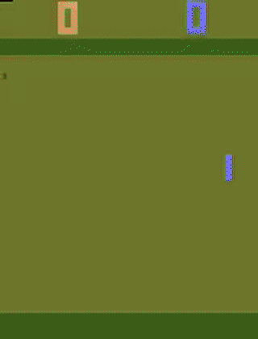
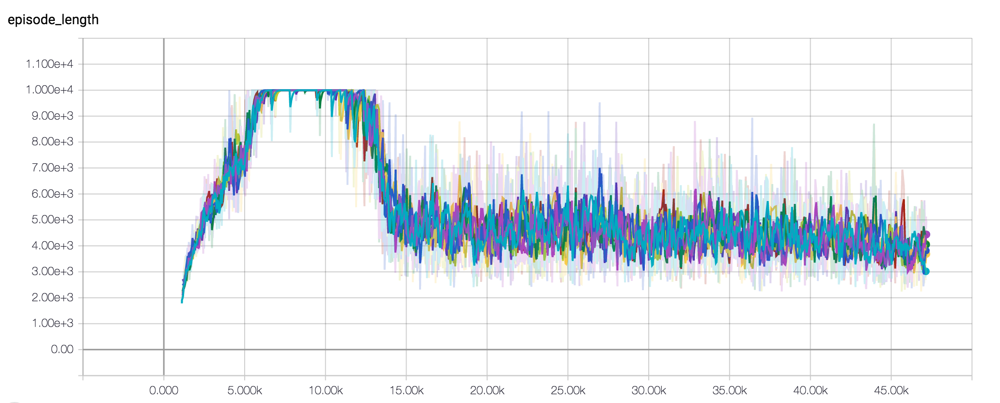
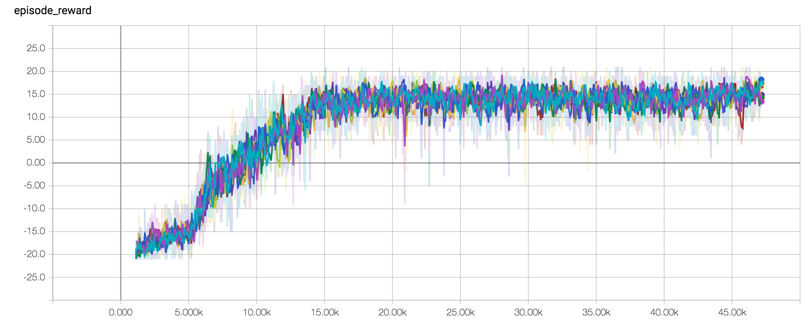

# Asynchronous Methods for Deep Reinforcement Learning (A3C)

  
<figcaption>After training for 6 hours</figcaption>

- A3C implementation in TensorFlow
- There are two versions
   - A3C using threads
   - A3C using distributed tensorflow
- Tested on "Pong-v0" which is a stochastic environment due to random frame skipping
- Original paper: https://arxiv.org/abs/1602.01783

## Tensorboard

### Episode length
- The time length of an episode increases as it starts to play neck and neck against the AI
- After an hour, the trained agent begins to beat the AI easily 

Episode reward
- The maximum score possible is 21

